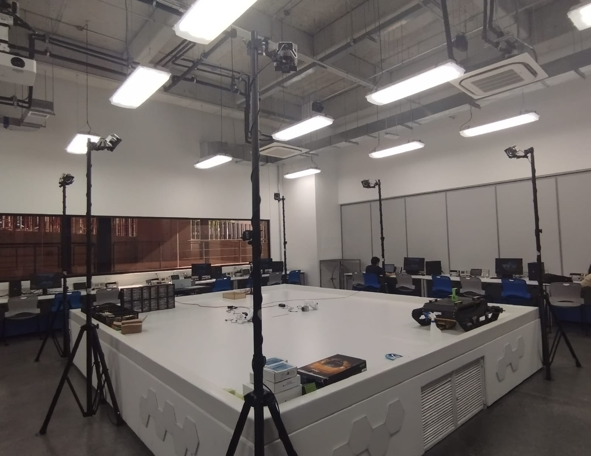
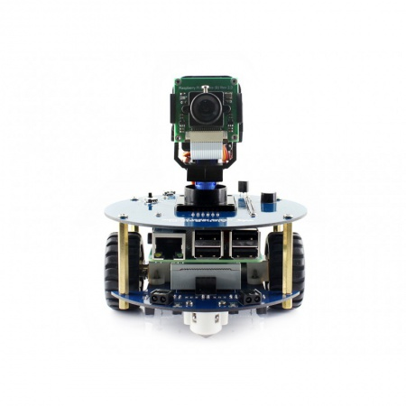
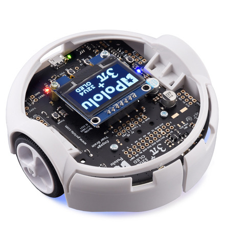

# Tesis_Valerie_Valdez_2023
## Repositorio para documentos, códigos, fotografías y formatos de intercambio de gráficos (GIF) de Valerie Valdez

El trabajo de graduación realizado se titula Implementación de algoritmos de física granular con agentes robóticos móviles en la plataforma Robotat. Los
algoritmos de física granular son herramientas numéricas esenciales para simular sistemas granulares, como materiales en polvo o granos, permitiendo la modelización de interacciones a nivel microscópico y la predicción del comportamiento del sistema. El objetivo principal del trabajo es evaluar y implementar algoritmos de física granular en agentes robóticos móviles en la plataforma Robotat que se puede observar a continuación.

**Figura 1, Plataforma Robotat**

Esta plataforma que es un sistema de experimentación para el campo de la robótica, se encuentra en las instalaciones de la Universidad del Valle de Guatemala. Este se inspira en el concepto del Robotarium desarrollado en el Instituto de Tecnología de Georgia, en Estados Unidos. El Robotat está constituido por una plataforma de acero color blanco, que se encuentra rodeada por el sistema OptiTrack, el cual está compuesto principalmente por 6 cámaras de captura de movimiento de alta precisión para realizar seguimiento preciso y registro de movimiento en tiempo real en un espacio determinado. 

Previamente, en la Universidad del Valle de Guatemala se llevó a cabo un proyecto de cooperación junto con la Universidad de Navarro, España. El objetivo del proyecto era utilizar robots Alphabot 2 para realizar pruebas de ejecución y validación de algoritmos de física granular estudiados por el Licenciado Juan Diego Robles (Tam, 2022). Por lo tanto, se construyó un sistema robótico que incluía una cámara de vídeo con brazo móvil articulado visto en la Figura 2. 

**Figura 2, Agente robótico Alphabot2**

La finalidad de este sistema era verificar la funcionalidad de la plataforma robótica Alphabot 2 así como su capacidad de ejecutar tareas relacionadas al seguimiento de líneas pintadas en el suelo. Para utilizar estos agentes, se requiere tener una base de conocimientos en la serie de ordenadores monoplaca Rasperry Pi, ya que para controlar el agente se utiliza una placa Rasperry Pi 3B. Asimismo, se requiere saber datos de implementación y funcionalidad de los agentes en general, es así que se utilizó un manual de usuario creado por Luis Nij ***[Colocar documento]***. Las pruebasmencionadas con anterioridad, se replicaron en este trabajo de graduación con el fin de comparar el funcionamiento y rendimiento que estos agentes robóticos móviles tendrían a comparación de los agentes robóticos Pololu 3Pi+ 32u4 OLED, los cuales se pueden observar en la Figura 3.

 
**Figura 3, Agente robótico Pololu 3Pi+ 32u4 OLED**

# Física granular
La física granular es una rama de la física que se enfoca en el estudio de materiales como arena, polvo, granos, entre otros. Estos muestran una variedad de comportamientos complejos y no lineales, a menudo impulsados por la interacción entre las partículas, que difieren en muchas maneras de otras sustancias. El propósito de esta rama de investigación es comprender los complejos comportamientos emergentes, originados en sistemas compuestos por una gran cantidad de partículas sólidas que interactúan entre sí (Jaeger, 2011). 

Algunas herramientas utilizadas para el estudio de la física granular son los algoritmos. Existen distintos algoritmos y si se desea saber un poco más acerca de ellos, se puede revisar el marco teórico del trabajo realizado, no obstante, en este repositorio se hablará únicamente de dos: *Dinámica molecular* y *La simulación directa de Monte Carlo*. El proceso que se llevó a cabo para realizar este trabajo de graduación se dividió en tres etapas interconectadas: primero, se investigaron y analizaron modelos y algoritmos de física granular; luego, se realizaron simulaciones computarizadas para evaluar el rendimiento de estos algoritmos; finalmente, se llevó a cabo una validación de resultados mediante experimentación física. 

# Pruebas computarizadas
Como se mencionó anteriormente en esta sección se destacan dos algoritmos de física granular: *Dinámica Molecular* y *La simulación directa de Monte Carlo*. Estos algoritmos se seleccionaron para realizar diversas simulaciones y así comprender cómo interactúan las partículas en un sistema y evolucionan con el tiempo. Para lograr esto, se aplican principios fundamentales de la física, como la Segunda Ley de Newton, que relaciona el cambio en el momento cinético con las fuerzas que
actúan sobre las partículas. Sin embargo, debido a la naturaleza discreta del tiempo en las simulaciones, se recurre a métodos numéricos para calcular las posiciones y velocidades en momentos futuros. En estas pruebas iniciales, [se implementó el algoritmo de Dinámica Molecular](Diagramas/DM_tiro_parabólico.drawio) para simular el movimiento de partículas en un entorno bidimensional, y al código se encuentra en este mismo [repositorio:](Códigos/DM_Computacional.m)

Los resultados más significativos para esta primera implementación se pueden observar como órbitas alrededor de partículas estáticas. Además, se exploraron las implicaciones de cambiar las condiciones iniciales y cómo esto afecta las trayectorias resultantes. Esto se puede en las imagenes a continuación. Estas muestran la evolución de las trayectorias de 3 partículas en estado dinámico orbitando sobre una partícula estacionaria. Cada una de las partículas dinámicas presenta una trayectoria distinta debido a que se inicializaron con distintas condiciones iniciales. La velocidad

Una parte fundamental de estas simulaciones es la consideración del potencial del LJP, que modela las interacciones entre partículas. Se demostró que el
comportamiento de las partículas está influenciado por las fuerzas atractivas y repulsivas del LJP, lo que puede dar lugar a cambios notables en las trayectorias. A medida que se avance en el capítulo, se evidencia que se examinaron simulaciones más complejas, incluyendo sistemas tridimensionales y configuraciones con un mayor número de partículas. Estas simulaciones dinámicas contribuyeron a indagar en comprender cómo las interacciones entre partículas pueden dar lugar a agrupamientos y patrones emergentes. En síntesis, en este capítulo se explora la dinámica molecular, la simulación directa de Monte Carlo y las simulaciones de sistemas granulares. Para obtener los resultados de las simulaciones, se desarrollaron múltiples códigos utilizando el software MATLAB. Asimismo, en las siguientes secciones se proporcionaron explicaciones detalladas de diferentes secciones de código para ayudar al lector a identificar y comprender las partes esenciales para realizar.

Esta contiene 100 partículas distribuidas equidistantes unas de las otras en un espacio de igual tamaño que las simulaciones anteriores. Esto puede observarse en la primera Figura que presenta una vista de los ejes Z y X de la simulación y la segunda Figura que presenta una vista isométrica de las tres dimensiones. 

Al pasar el tiempo, se evidencian comportamientos interesantes en donde en un sistema con muchas partículas aleatorias, es estadísticamente probable que algunas de estas partículas se acerquen lo suficiente como para experimentar interacciones atractivas debido al LJP. Cuando algunas partículas comienzan a acercarse, se forman pequeños grupos.

# Referencias
Jaeger & Sidney. (2011). *Physics of the Granular State.* https://pdodds.w3.uvm.edu/teaching/courses/2009-08UVM-300/docs/others/everything/jaeger1992a.pdf

Maderer, J. (2017). *Robotarium: A Robotics Lab Accessible to All, 2017.*https://news.gatech.edu/archive/features/robotarium-robotics-lab-accessible-all.shtml

Nij, L. (2022). *Evaluación y validación de plataformas móviles para aplicaciones prácticas de robótica* https://drive.google.com/drive/u/0/folders/1Iluqcd77KztsevXLYBS1m8kBzAv0Sk9I

T. Schwager, *Computational Granular Dynamics* vol. 221, n.o 1-2, 2005.

Tam, A.(2022). *Aplicaciones prácticas para algoritmos de inteligencia y robótica de enjambre* https://repositorio.uvg.edu.gt/handle/123456789/4256
