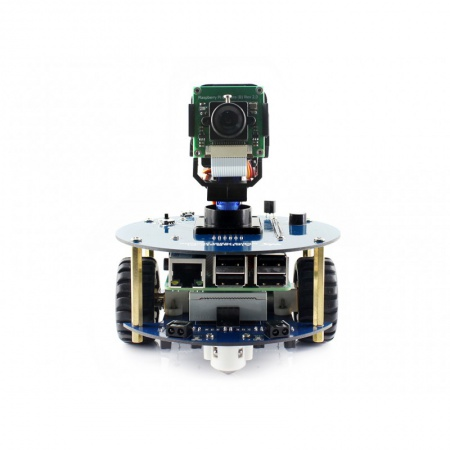
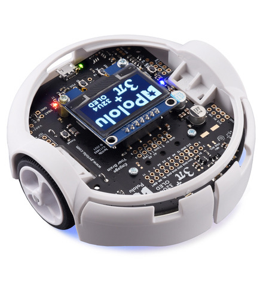

# Tesis_Valerie_Valdez_2023
## Repositorio para documentos, códigos, fotografías y formatos de intercambio de gráficos (GIF) de Valerie Valdez

El trabajo de graduación realizado se titula Implementación de algoritmos de física granular con agentes robóticos móviles en la plataforma Robotat. Los
algoritmos de física granular son herramientas numéricas esenciales para simular sistemas granulares, como materiales en polvo o granos, permitiendo la modelización de interacciones a nivel microscópico y la predicción del comportamiento del sistema. El objetivo principal de este estudio es evaluar y implementar algoritmos de física granular en agentes robóticos móviles en la plataforma Robotat que se puede observar a continuación.

Esta plataforma que es un sistema de experimentación para el campo de la robótica, se encuentra en las instalaciones de la Universidad del Valle de Guatemala. Este se inspira en el concepto del Robotarium desarrollado en el Instituto de Tecnología de Georgia, en Estados Unidos. El Robotat está constituido por una plataforma de acero color blanco, que se encuentra rodeada por el sistema OptiTrack, el cual está compuesto principalmente por 6 cámaras de captura de movimiento de alta precisión para realizar seguimiento preciso y registro de movimiento en tiempo real en un espacio determinado. 

Previamente, en la Universidad del Valle de Guatemala se llevó a cabo un proyecto de cooperación junto con la Universidad de Navarro, España. El objetivo del proyecto era utilizar robots Alphabot 2 para realizar pruebas de ejecución y validación de algoritmos de física granular estudiados por el Licenciado Juan Diego Robles. Por lo tanto, se construyó un sistema robótico que incluía una cámara de vídeo con brazo móvil articulado visto a continuación. 

La finalidad de este sistema era verificar la funcionalidad de la plataforma robótica Alphabot 2 así como su capacidad de ejecutar tareas relacionadas al seguimiento de líneas pintadas en el suelo. Estas pruebas, se replicaron para este trabajo de graduación, con el fin de comparar el funcionamiento y rendimiento que estos agentes robóticos móviles tendrían a comparación de los agentes robóticos Pololu 3Pi+ 32u4 OLED, los cuales se pueden observar en la siguiente imagen.

